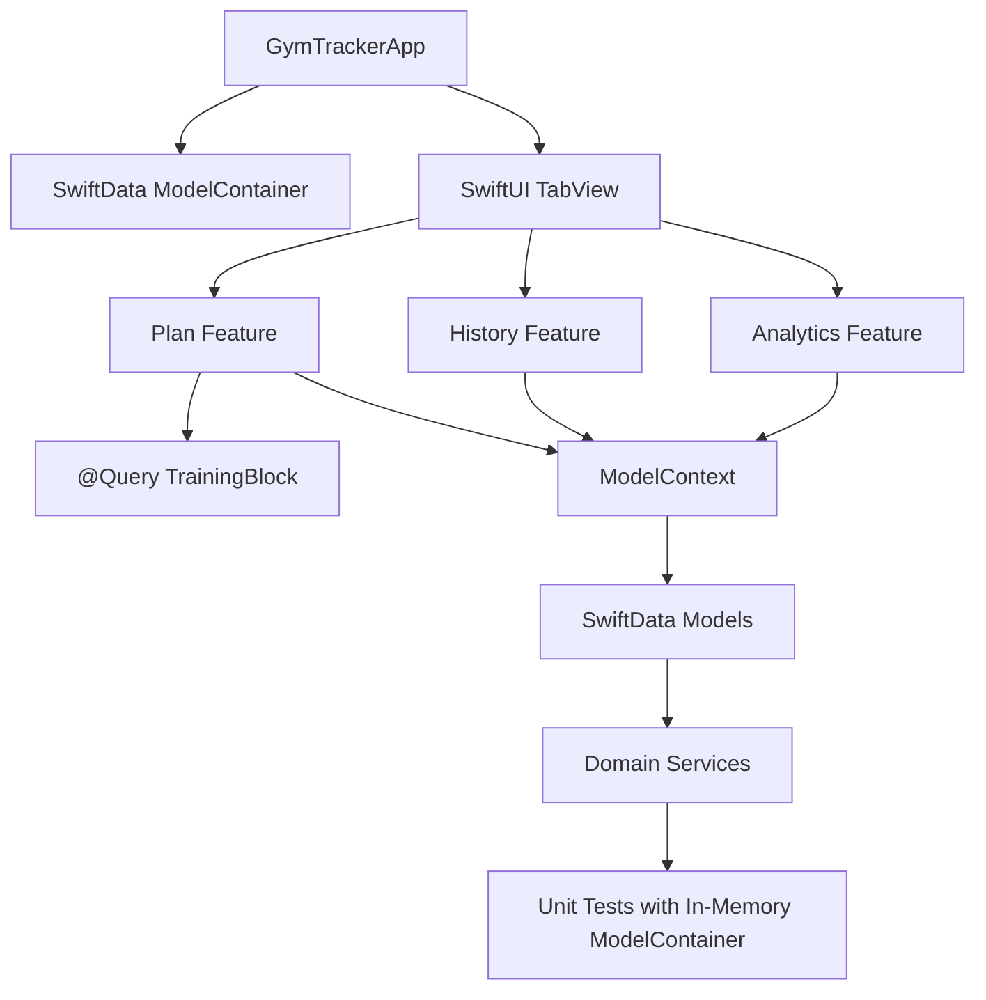

# Architecture Review

Datum: 2026-05-24
Projekt: GymTracker iOS
Status: Abschnitt 1.2 abgeschlossen und durch Build/Test-Baseline verifiziert

## Architekturuebersicht

GymTracker folgt aktuell einer nativen SwiftUI-/SwiftData-Architektur mit Feature-Slices und separaten Domain-/Data-Ordnern. Die Richtung entspricht der vorhandenen ADR `docs/adr/0001-native-swiftui-mvvm-swiftdata.md`.

Schichten:

- App: `GymTrackerApp`, `AppEnvironment`
- Features: SwiftUI Screens und feature-nahe Presentation/ViewModel-Typen
- Domain: fachliche Services, Enums, kleine Models
- Data: SwiftData-Modelle, Seed-/Demo-Daten
- DesignSystem: Theme Tokens und Modifier
- Tests: Swift Testing Unit Tests

## Datenfluss

## Moduluebersicht

### App

`GymTrackerApp` erzeugt die Tab-Struktur und injiziert den `ModelContainer`. `AppEnvironment` existiert als DI-Einstieg, ist aber noch sehr klein. Container-Initialisierungsfehler werden seit Abschnitt 6.2 als Startup-Fehlerzustand angezeigt.

Bewertung: Grundstruktur sauber, DI noch nicht konsequent.

### Features

`Features/Plan`, `Features/Session`, `Features/History`, `Features/Analytics` und `Features/Dashboard` sind nach Produktbereichen gruppiert.

Bewertung: Gute fachliche Gruppierung. Einige Feature-Dateien sind zu gross und enthalten gemischte Verantwortlichkeiten. `PlanActionService` reduziert seit Abschnitt 2.2/2.3 die Side Effects in `PlanView`.

### Domain

Domain Services sind gut testbar und ueberwiegend frei von UI-Abhaengigkeiten. Beispiele: `SessionStartService`, `SessionCompletionService`, `VolumeCalculator`, `RIRAnalyzer`, `PainThresholdEvaluator`, `ChartDataMapper`, `TrainingExportService`.

Bewertung: Staerkster Architekturteil; Services sind klein bis mittelgross und gut testbar.

### Data

SwiftData-Modelle liegen zentral in `TrainingModels.swift`; Seed-Importe sind in eigenen Services gekapselt. Der leere Repository-Platzhalter wurde in Abschnitt 2.1 entfernt.

Bewertung: SwiftData-Modellgraph ist nachvollziehbar, aber gross. Repository-/Store-Strategie ist unentschieden; tote Repository-Platzhalter wurden entfernt.

### DesignSystem

`AppTheme` bietet Spacing, Radius, Shadow und View Modifier.

Bewertung: Gute Basis, aber wiederverwendbare Komponenten sind noch kaum belegt.

## Architektur-Checklist

- [x] MVVM korrekt umgesetzt: teilweise. Views plus ViewModels/Presentation-Typen sind vorhanden.
- [x] Separation of Concerns: teilweise gut in Domain, schwach in grossen SwiftUI Views.
- [x] Dependency Injection vorhanden: minimal ueber `AppEnvironment`; Services wie `PlanActionService` erhalten `ModelContext` per Init.
- [x] Services korrekt getrennt: ueberwiegend ja.
- [x] State Management sauber: lokal nachvollziehbar, aber grosse Views halten viele `@State`- und SwiftData-Side-Effects.
- [x] Navigation konsistent: SwiftUI `TabView` und `NavigationStack` werden konsistent genutzt.
- [x] Reusable Components vorhanden: teilweise, z.B. Plan-Zeilen und Theme Modifier; Ausbau sinnvoll.
- [x] Side Effects sauber gekapselt: teilweise. Domain Services ja; Plan-Aktionen sind begonnen gekapselt, Editor-Forms und weitere grosse Views noch nicht ausreichend.

## Risiken

- `PlanView` mischt weiterhin Navigation, UI und Fehlerbehandlung; Import, Demo-Load und Persistenzmutation wurden teilweise in `PlanActionService` verschoben.
- `HistoryView` und `ActiveSessionView` sind sehr gross und schwer isoliert testbar.
- `TrainingPlanEditorViewModel` hat viele Verantwortlichkeiten in einem Typ.
- Die leere Repository-Schicht wurde in Abschnitt 2.1 entfernt; offen bleibt die bewusste Entscheidung zwischen Store-/Repository-Schicht und direktem SwiftData-Zugriff.
- Live-Container-Setup ist robuster, weil Container-Fehler nicht mehr per `fatalError` crashen. Preview-spezifische `fatalError`-Pfade bleiben offen.
- Kein UI-Test-Target deckt reale Nutzerfluesse ab.
- Versionierte Build-Artefakte wurden in Abschnitt 2.1 bereinigt und sind kein offenes Architektur-/Repo-Hygiene-Risiko mehr.

## Empfehlungen

1. Architekturentscheidung dokumentieren: SwiftData direkt in Views/Services oder Store-/Repository-Schicht einfuehren.
2. Verbleibende `PlanView`-UI in kleinere Komponenten aufteilen und `PlanActionService` bei Import-/Fehlerpfaden weiter testen.
3. `TrainingPlanEditorViewModel` in Validation, Reordering, Duplication und Sync-Services teilen.
4. Grosse SwiftUI Views schrittweise in kleine Komponenten plus Presentation Mapper aufteilen.
5. AppEnvironment als echte Composition Root ausbauen und Startup-Fehlerzustand weiter ausformulieren.
6. UI-Test-Target fuer kritische User Flows einfuehren.

## Refactoring-Empfehlungen

Kurzfristig:

- `build/` aus Git entfernen. Status: erledigt in Abschnitt 2.1.
- Leeren Repository-Platzhalter entfernen. Status: erledigt in Abschnitt 2.1.
- Testdateien nach getesteten Typen splitten.
- `PlanView`-Aktionen extrahieren. Status: Create, Demo-Load, Import, Duplicate, Archive und Delete in `PlanActionService` verschoben.

Mittelfristig:

- `ActiveSessionView` und `HistoryView` zerlegen.
- SwiftData-Fehlerpfade robuster machen. Status: Live-Container-Startup in Abschnitt 6.2 verbessert; weitere Speicher-/Importfehler offen.
- Lint-/Format-Automation einfuehren.

Langfristig:

- Repository-/Store-Schicht fuer planbare Datenzugriffe entscheiden.
- Accessibility-/Dynamic-Type-/Offline-Verhalten systematisch testen.

## Verifikation Abschnitt 1

- Build: `BUILD SUCCEEDED`
- Tests: `TEST SUCCEEDED`
- Bekannte Warnungen: doppelte Simulator-Destination und AppIntents-Metadatenhinweis ohne AppIntents-Abhaengigkeit.
