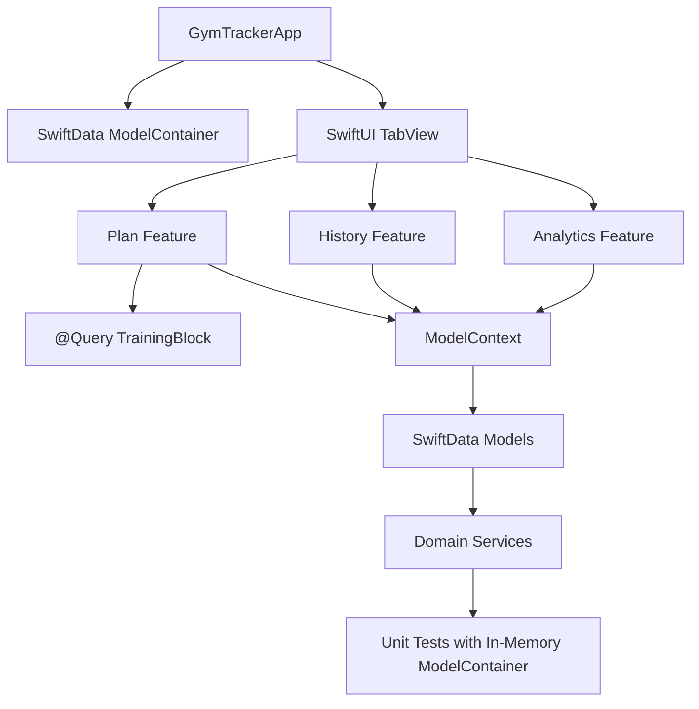

# Architecture Review

Datum: 2026-05-24
Projekt: GymTracker iOS
Status: Abschnitt 1.2 abgeschlossen und durch Build/Test-Baseline verifiziert

## Architekturuebersicht

GymTracker folgt aktuell einer nativen SwiftUI-/SwiftData-Architektur mit Feature-Slices und separaten Domain-/Data-Ordnern. Die Richtung entspricht der vorhandenen ADR `docs/adr/0001-native-swiftui-mvvm-swiftdata.md`.

Schichten:

- App: `GymTrackerApp`, `AppEnvironment`
- Features: SwiftUI Screens und feature-nahe Presentation/ViewModel-Typen
- Domain: fachliche Services, Enums, kleine Models
- Data: SwiftData-Modelle, Seed-/Demo-Daten, Repository-Platzhalter
- DesignSystem: Theme Tokens und Modifier
- Tests: Swift Testing Unit Tests

## Datenfluss

## Moduluebersicht

### App

`GymTrackerApp` erzeugt die Tab-Struktur und injiziert den `ModelContainer`. `AppEnvironment` existiert als DI-Einstieg, ist aber noch sehr klein.

Bewertung: Grundstruktur sauber, DI noch nicht konsequent.

### Features

`Features/Plan`, `Features/Session`, `Features/History`, `Features/Analytics` und `Features/Dashboard` sind nach Produktbereichen gruppiert.

Bewertung: Gute fachliche Gruppierung. Einige Feature-Dateien sind zu gross und enthalten gemischte Verantwortlichkeiten.

### Domain

Domain Services sind gut testbar und ueberwiegend frei von UI-Abhaengigkeiten. Beispiele: `SessionStartService`, `SessionCompletionService`, `VolumeCalculator`, `RIRAnalyzer`, `PainThresholdEvaluator`, `ChartDataMapper`, `TrainingExportService`.

Bewertung: Staerkster Architekturteil; Services sind klein bis mittelgross und gut testbar.

### Data

SwiftData-Modelle liegen zentral in `TrainingModels.swift`; Seed-Importe sind in eigenen Services gekapselt. `RepositoryProtocols.swift` ist aktuell leer.

Bewertung: SwiftData-Modellgraph ist nachvollziehbar, aber gross. Repository-Strategie ist unentschieden.

### DesignSystem

`AppTheme` bietet Spacing, Radius, Shadow und View Modifier.

Bewertung: Gute Basis, aber wiederverwendbare Komponenten sind noch kaum belegt.

## Architektur-Checklist

- [x] MVVM korrekt umgesetzt: teilweise. Views plus ViewModels/Presentation-Typen sind vorhanden.
- [x] Separation of Concerns: teilweise gut in Domain, schwach in grossen SwiftUI Views.
- [x] Dependency Injection vorhanden: minimal ueber `AppEnvironment`, Services erhalten `ModelContext` per Init.
- [x] Services korrekt getrennt: ueberwiegend ja.
- [x] State Management sauber: lokal nachvollziehbar, aber grosse Views halten viele `@State`- und SwiftData-Side-Effects.
- [x] Navigation konsistent: SwiftUI `TabView` und `NavigationStack` werden konsistent genutzt.
- [x] Reusable Components vorhanden: teilweise, z.B. Plan-Zeilen und Theme Modifier; Ausbau sinnvoll.
- [x] Side Effects sauber gekapselt: teilweise. Domain Services ja, `PlanView` und Editor-Forms noch nicht ausreichend.

## Risiken

- `PlanView` mischt Navigation, UI, Import, Demo-Load, Persistenzmutation und Fehlerbehandlung.
- `HistoryView` und `ActiveSessionView` sind sehr gross und schwer isoliert testbar.
- `TrainingPlanEditorViewModel` hat viele Verantwortlichkeiten in einem Typ.
- Leere Repository-Schicht erzeugt Architektur-Unklarheit.
- `fatalError` im Live-Container-Setup ist fuer Robustheit kritisch.
- Kein UI-Test-Target deckt reale Nutzerfluesse ab.

## Empfehlungen

1. Architekturentscheidung dokumentieren: SwiftData direkt in Views/Services oder Repository-Schicht einfuehren.
2. `PlanView`-Side-Effects in Service/Store auslagern.
3. `TrainingPlanEditorViewModel` in Validation, Reordering, Duplication und Sync-Services teilen.
4. Grosse SwiftUI Views schrittweise in kleine Komponenten plus Presentation Mapper aufteilen.
5. AppEnvironment als echte Composition Root ausbauen oder ungenutzte Factories entfernen.
6. UI-Test-Target fuer kritische User Flows einfuehren.

## Refactoring-Empfehlungen

Kurzfristig:

- `build/` aus Git entfernen.
- Testdateien nach getesteten Typen splitten.
- `PlanView`-Aktionen extrahieren.

Mittelfristig:

- `ActiveSessionView` und `HistoryView` zerlegen.
- SwiftData-Fehlerpfade robuster machen.
- Lint-/Format-Automation einfuehren.

Langfristig:

- Repository-/Store-Schicht fuer planbare Datenzugriffe entscheiden.
- Accessibility-/Dynamic-Type-/Offline-Verhalten systematisch testen.

## Verifikation Abschnitt 1

- Build: `BUILD SUCCEEDED`
- Tests: `TEST SUCCEEDED`
- Bekannte Warnungen: doppelte Simulator-Destination und AppIntents-Metadatenhinweis ohne AppIntents-Abhaengigkeit.
